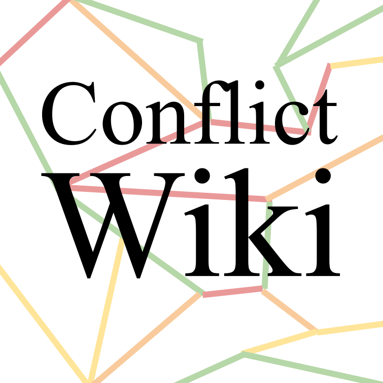

# ConflictWiki Data


[](https://conflict-ai.github.io/conflictwiki/)
<frontend src="experiments/images/favicon.png"  width="20" height="20" />


ConflictWiki is a scrape of Wikipedia articles on militarized conflict as described in our [paper](https://aclanthology.org/2021.emnlp-main.613/).
The data (v2) can be found [here](files/data), but we are curently working on producing an updated and bigger scrape.
We also set up an experimental [frontend](https://conflict-ai.github.io/conflictwiki/) that allows you to quickly inspect the data.


## Citing
Please cite as follows 

```
@article{
stoehr2021classifying,
title={Classifying Dyads for Militarized Conflict Analysis},
author={Niklas Stoehr, Lucas Torroba Hennigen, Samin Ahbab, Robert West and Ryan Cotterell},
booktitle={Proceedings of the 2021 Conference on Empirical Methods in Natural Language Processing (EMNLP)},
year={2021},
url={https://conflict-ai.github.io/conflictwiki/},
}
```


