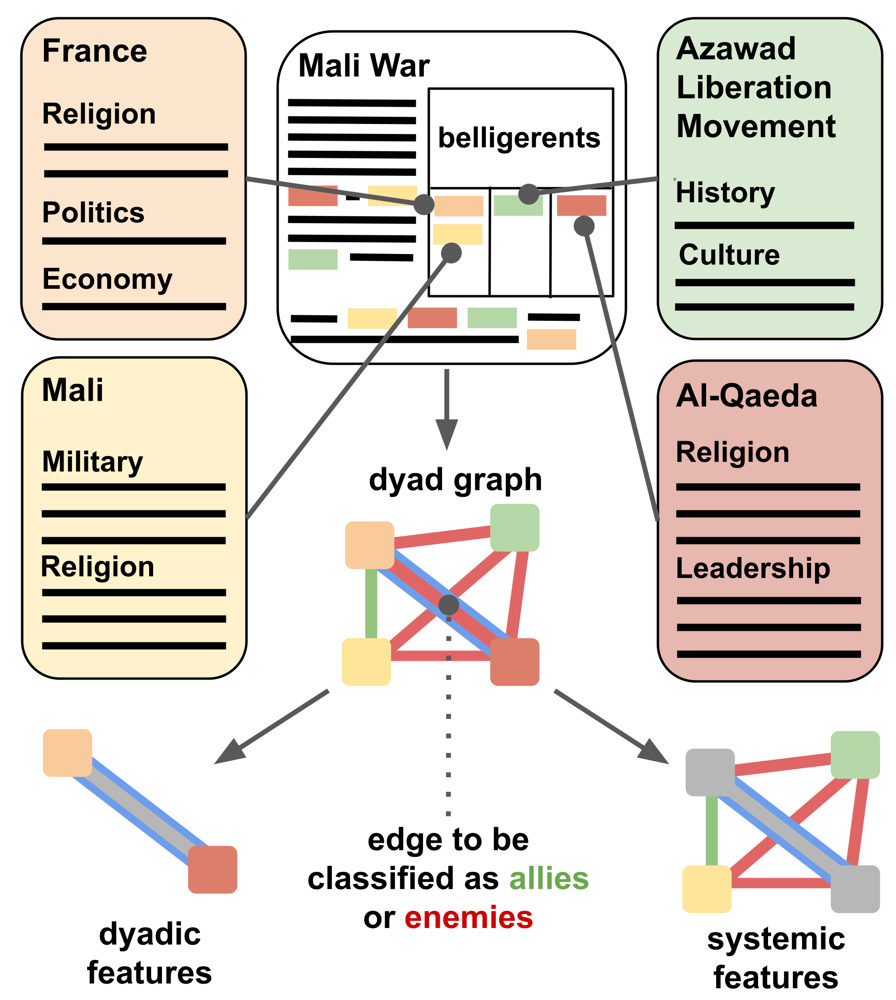
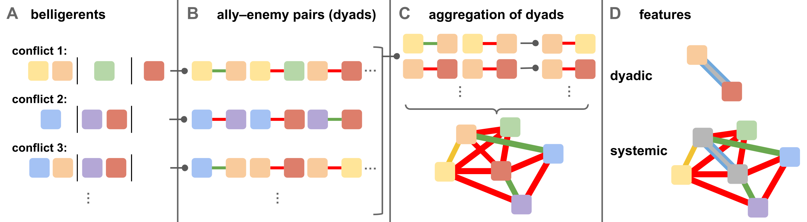

# ConflictWiki Data v0.1


[](https://conflict-ai.github.io/conflictwiki/)
<frontend src="experiments/images/favicon.png"  width="20" height="20" />


We introduce the ConflictWiki dataset, a large collection of [Wikipedia articles on armed conflict](https://en.wikipedia.org/wiki/Category:Conflicts).
Each conflict is annotated with starting and end date, location, casualty counts, group strengths and conflict outcome. 
If provided on Wikipedia, entity articles feature auxiliary tabular information on languages, religion, ISO2 code and ideology. 

[ConflictWiki Frontend](https://conflict-ai.github.io/conflictwiki/) 


For examples on how to load and visualise the data please see here:

[loading all data](tutorials/data%20loading.ipynb) <br>
[visualising the data as network](tutorials/network%20loading.ipynb)

For reproducing the experiments, we prepared several Jupyter notebooks:

[tf-idf analysis](experiments/tf-idf%20analysis.ipynb) <br>
[tf-idf visualisation](experiments/tf-idf%20visualisation.ipynb) <br>
[section similarity](experiments/section%20similarity.ipynb) <br>
[dyadic setting](experiments/dyadic.ipynb) <br>
[systemic setting](experiments/systemic.ipynb) 





## Citing
Please cite as follows 

```
@article{
stoehr2021text,
title={Text or Topology? Classifying Ally-Enemy Pairs in Militarised Conflict},
author={Niklas Stoehr, Lucas Torroba Hennigen, Samin Ahbab, Robert West and Ryan Cotterell},
booktitle={Proceedings of the 2021 Conference on Empirical Methods in Natural Language Processing (EMNLP)},
year={2021},
url={https://conflict-ai.github.io/conflictwiki/},
}
```


## Data 

The data is divided into 

(1) [data mappings](mappings/) containing meta data such as ally-enemy pairs, network structure and
auxiliary information.

(2) the actual raw textual data which can be downloaded [here](https://drive.google.com/drive/folders/19wWcmInw7rxnLYeV8n-RdpdU6pdePOdT?usp=sharing).

## Repository and Code

```
|   repo
    |   mappings
        |   conflict
            |   infos / auxiliary information
        |   entity
            |   infos / auxiliary information
        |   conflict_entity
            | ally-enemy pairs
            | conflict_entity_ids
        |   network
                |   aggr_edge_list
                |   node_list
    |   code
    |   experiments
    |   tutorials
```

### mappings
#### conflict

contains all information on the conflicts as extracted from the [Wikipedia militarized conflict template](https://en.wikipedia.org/wiki/Template:Infobox_military_conflict).

`conflict_id`, `conflict_name`, `place`,  `date`, `date_start`, `date_end`, `n_belligerents`, `n_entities`, `strength`, `strength_num`, `casualties`, `casualties_num`, `commander`, `commander_num`, `result` tags.<br>

date holds the date as a string, date_start and date_end are extracted from date and are datetime objects; <br>
n_belligerents, n_entities state the number of entities and belligerents involved in the conflict; <br>
strength and casualties estimate group strengths and losses per belligerent (dictionary keys are belligerent indeces); <br>
strength_num and casualties_num are numbers extracted from strength and casualties (dictionary keys are belligerent indeces); <br>
commander lists all military commanders per belligerent (dictionary keys are belligerent indeces); <br>
result is a brief textual summary of the outcome  <br>


#### entity

contains all information on the entities as extracted from the [Wikipedia article info box](https://en.wikipedia.org/wiki/Mali).

`entity_id`, `entity_name`, `num_conflicts`, `iso`, `language`, `religion`, `ideology`<br>

num_conflicts gives the number of conflicts, the entity is involved in; <br>

#### conflict_entity

###### conflict_entity_id

Contains the ids of all conflicts and the ids of all involved entities partitioned into belligerents.
In the examplatory conflict below, we have three belligerents, of which the first two are formed by two entities each 
and the third belligerent consists of only one entity

```
{conflict_id: [[entity_id, entity_id, entity_id, entity_id],[entity_id]]}
(1220919: [[1576797, 31717, 4887, 3434750], [40596311]])
```

###### ally_enemy_pairs

Contains the ids of entity pairs, a conflict id and the relationship of the entities in the given conflict as displayed below

```
((entity_id 1, entity_id 2), conflict_id, entity_relationship)
((27019, 103100), 22738, "enemies")
```

#### network

Contains the precomputed, aggregated network, where nodes are entities and edges are all conflicts between any two respective entities aggregated.
Aggregated dyad network; nodes represent entities, edges represent aggregated conflicts between entities, edge line width represents number of conflicts, edge colouring represents relationship




###### aggr_edge_list

List of edges, each item is a triple (node_id 1, node_id 2, edge attributes)

```
(entity_id 1, entity_id 2, conflict attributes)
27019,	103100,	{'label': 'enemies', 'label_discrete': 0, 'label_continuous': -1, 'n_conflicts': 1, 'conflict_ids': [22738], 'conflict_names': ['Operation Enduring Freedom']}
```

###### node_list

List of nodes, each item is a tuple (node_id, node attributes)

```
(entity_id, entity attributes)
3343, {'name': 'Belgium'}
```